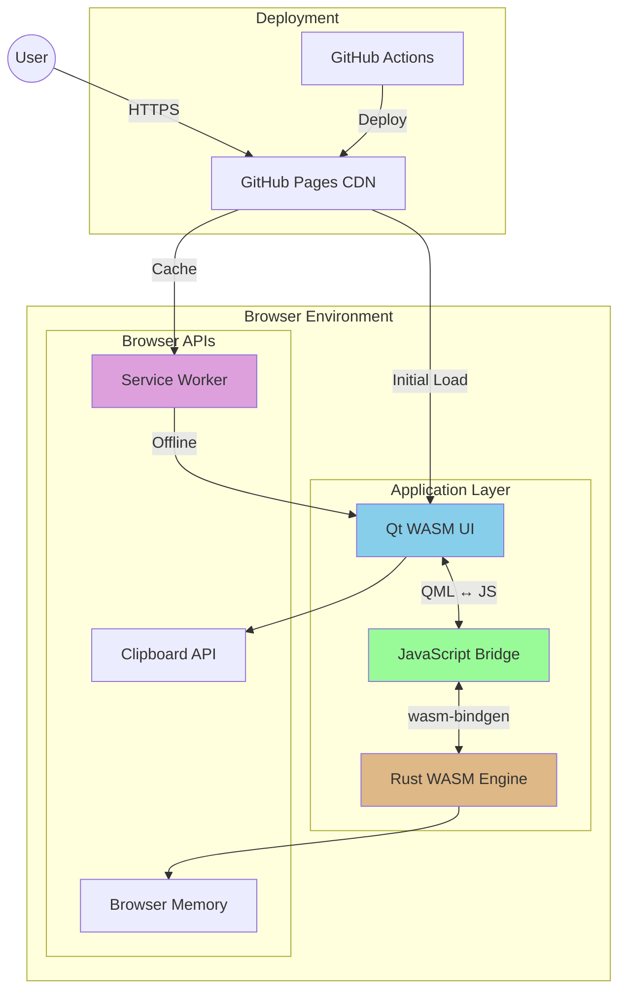
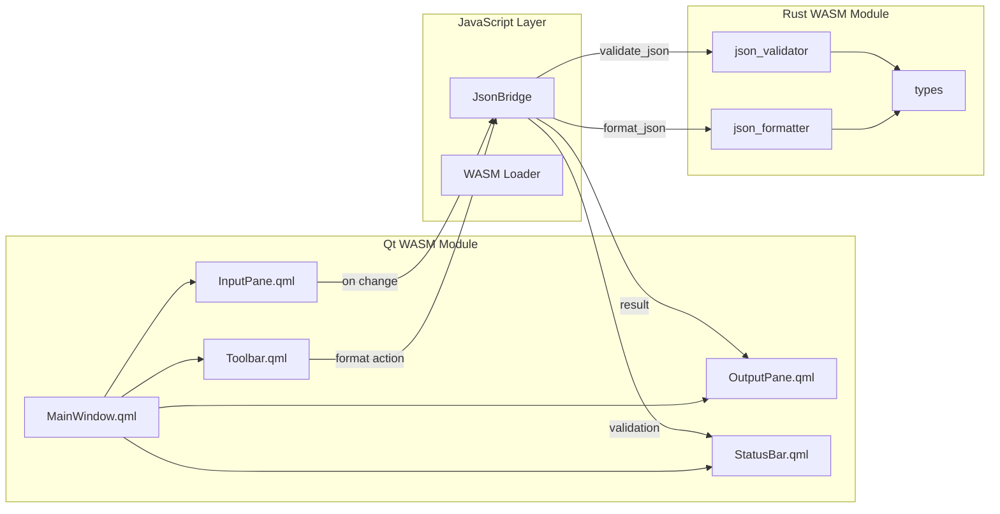
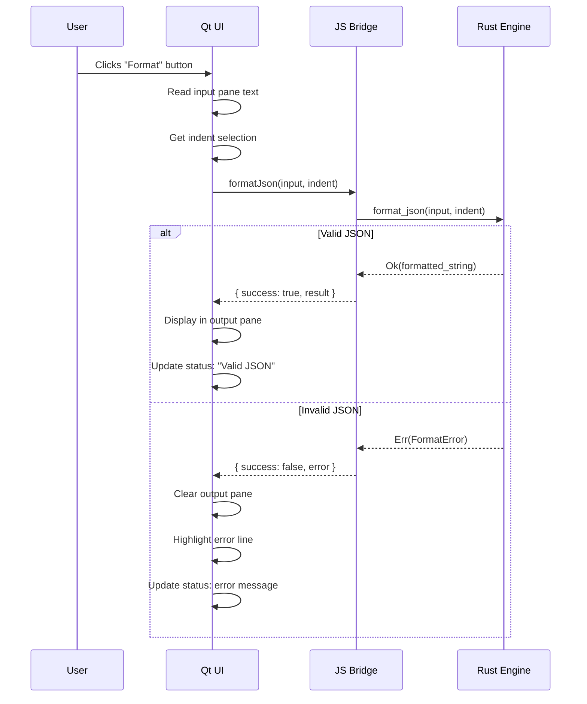
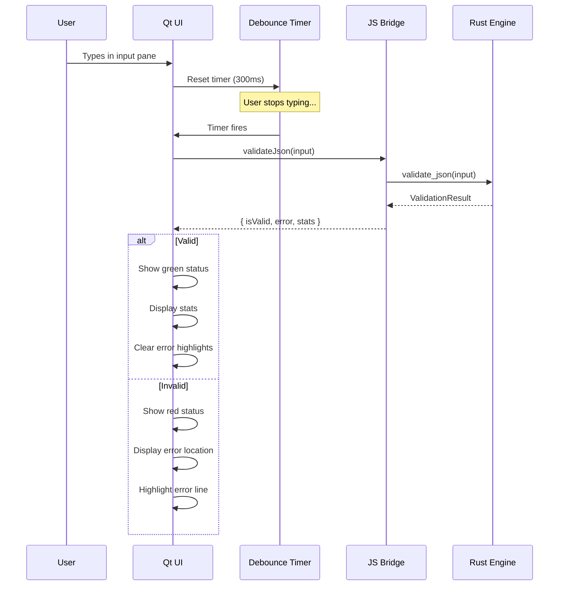
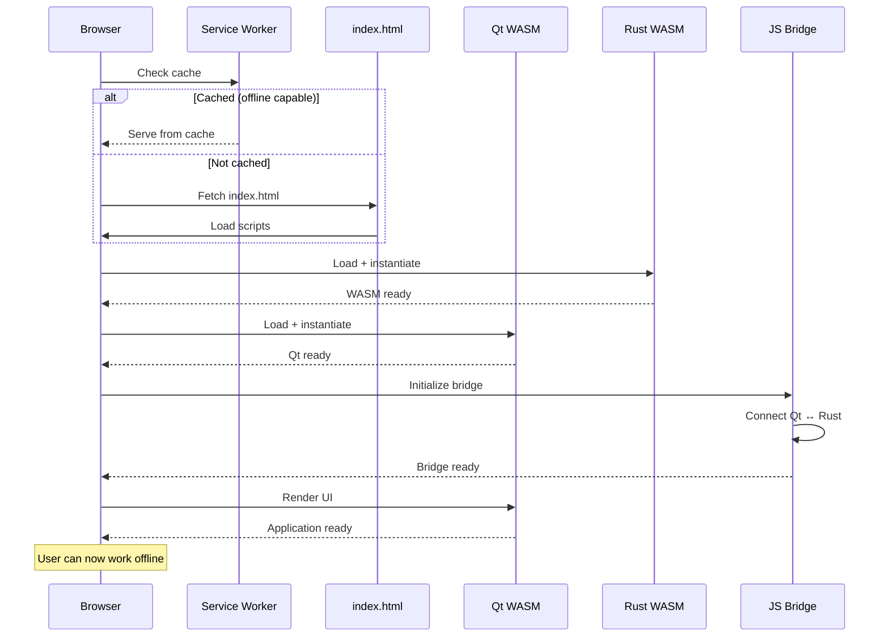
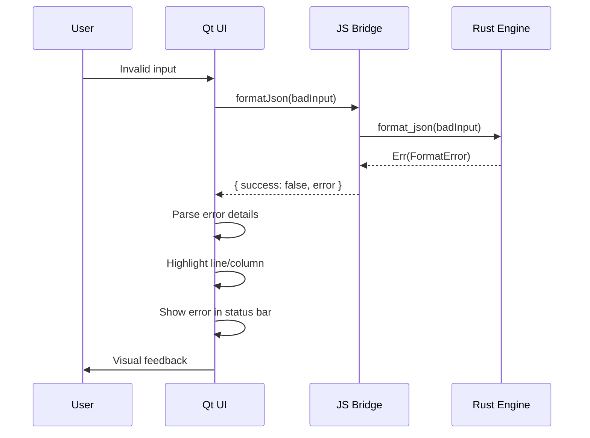

# Airgap JSON Formatter - Architecture Document

## 1. Introduction

This document defines the technical architecture for the Airgap JSON Formatter, a security-first, client-side JSON manipulation tool. The application combines Rust for core logic, Qt for the GUI, and WebAssembly for browser delivery - all executing 100% client-side with zero network communication after initial load.

This architecture is unique: rather than a traditional frontend/backend split, it's a **client-side monolith** where two WASM modules (Rust logic + Qt UI) communicate via a JavaScript bridge layer, all running within the browser sandbox.

### 1.1 Starter Template or Existing Project

**N/A - Greenfield project**

No starter template is used. This project requires custom integration between:
- Rust compiled to WASM via `wasm-bindgen`
- Qt 6 compiled to WASM via Emscripten (Qt for WebAssembly)

### 1.2 Change Log

| Date | Version | Description | Author |
|------|---------|-------------|--------|
| 2025-01-20 | 1.0 | Initial architecture document | Winston (Architect) |

---

## 2. High-Level Architecture

### 2.1 Technical Summary

The Airgap JSON Formatter employs a **client-side monolith architecture** where all processing occurs within the browser. The system consists of two WebAssembly modules: a Rust-based JSON processing engine (compiled via wasm-bindgen) and a Qt-based UI layer (compiled via Emscripten). These modules communicate through a JavaScript bridge that marshals data between the two WASM runtimes. The application is deployed as static files to GitHub Pages, with a Service Worker providing offline capability. This architecture achieves the PRD's zero-network requirement by design - after initial asset loading, the application is completely self-contained with no external dependencies.

### 2.2 Platform and Infrastructure

**Platform:** GitHub Pages (Static Hosting)

**Key Services:**
- GitHub Pages: Static file hosting with HTTPS
- GitHub Actions: CI/CD pipeline for build and deployment
- Service Worker: Client-side caching for offline support

**Deployment Regions:** GitHub Pages CDN (global edge distribution)

**Rationale:** GitHub Pages is the simplest deployment option for a zero-backend application. It provides free HTTPS hosting, integrates seamlessly with GitHub Actions, and has global CDN distribution. No cloud compute services are needed since all processing is client-side.

### 2.3 Repository Structure

**Structure:** Monorepo (single repository)

**Monorepo Tool:** N/A (simple structure, no workspace tool needed)

**Package Organization:**
- `/src` - Rust source code (JSON engine)
- `/qt` - Qt/QML source code (UI)
- `/public` - Static assets and HTML shell
- `/dist` - Build output (git-ignored)
- `/docs` - Documentation

**Rationale:** The tightly-coupled nature of the two WASM modules and their shared build pipeline makes a monorepo the natural choice. The project is small enough that workspace tooling (like Cargo workspaces or npm workspaces) adds unnecessary complexity.

### 2.4 High-Level Architecture Diagram



### 2.5 Architectural Patterns

- **Client-Side Monolith:** All application code runs in the browser as WASM modules. No server-side processing exists. _Rationale:_ Enforces zero-network requirement by architecture, not policy.

- **Bridge Pattern (WASM Integration):** JavaScript layer mediates between Qt WASM and Rust WASM modules. _Rationale:_ Qt uses Emscripten bindings while Rust uses wasm-bindgen; JavaScript is the common interface language.

- **Offline-First Architecture:** Service Worker caches all assets; application functions without network. _Rationale:_ Core privacy requirement - users must be able to disconnect and continue working.

- **Stateless Processing:** No persistent state between sessions; all data lives in memory only. _Rationale:_ Privacy requirement prohibits localStorage/IndexedDB storage of user JSON content.

- **Unidirectional Data Flow:** User input → Rust engine → formatted output → UI display. _Rationale:_ Simple, predictable flow that's easy to test and debug.

---

## 3. Tech Stack

### 3.1 Technology Stack Table

| Category | Technology | Version | Purpose | Rationale |
|----------|------------|---------|---------|-----------|
| Core Language | Rust | stable (1.75+) | JSON processing engine | Memory safety, performance, excellent WASM support |
| UI Framework | Qt 6 | 6.6+ | Cross-platform UI | Desktop-grade UX, official WASM support, QML declarative UI |
| WASM Toolchain (Rust) | wasm-bindgen | 0.2.x | Rust-to-JS bindings | De facto standard for Rust WASM, generates TypeScript types |
| WASM Toolchain (Qt) | Emscripten | 3.1.x | Qt WASM compilation | Required by Qt for WebAssembly |
| JSON Library | serde_json | 1.x | JSON parsing/serialization | Industry standard Rust JSON library, high performance |
| Build Tool (Rust) | Cargo | stable | Rust build system | Standard Rust toolchain |
| Build Tool (Qt) | CMake | 3.21+ | Qt build system | Required by Qt 6 |
| WASM Optimization | wasm-opt | latest | Binary optimization | Reduces WASM size significantly |
| Service Worker | Workbox | 7.x | Offline caching | Simplifies SW implementation, reliable caching strategies |
| CI/CD | GitHub Actions | N/A | Build and deploy | Native GitHub integration, free for public repos |
| Linting (Rust) | clippy | stable | Code quality | Catches common Rust mistakes |
| Formatting (Rust) | rustfmt | stable | Code formatting | Consistent style |
| Testing (Rust) | cargo test | stable | Unit testing | Built-in Rust testing framework |
| Testing (Integration) | wasm-bindgen-test | 0.3.x | WASM testing | Tests WASM in actual browser environment |

---

## 4. Data Models

This application has minimal data models since it processes transient JSON without persistence. The key types define the interface between UI and engine.

### 4.1 IndentStyle

**Purpose:** Represents user's indentation preference for JSON formatting.

**Key Attributes:**
- `variant`: enum - Either `Spaces(u8)` or `Tabs`

```rust
// Rust Definition (src/types.rs)
#[derive(Clone, Copy, Debug, PartialEq)]
pub enum IndentStyle {
    Spaces(u8),  // Number of spaces (typically 2 or 4)
    Tabs,
}

impl Default for IndentStyle {
    fn default() -> Self {
        IndentStyle::Spaces(4)
    }
}
```

```typescript
// TypeScript Definition (generated by wasm-bindgen)
type IndentStyle =
    | { type: 'spaces'; count: number }
    | { type: 'tabs' };
```

### 4.2 FormatError

**Purpose:** Represents an error encountered during JSON parsing/formatting.

**Key Attributes:**
- `message`: string - Human-readable error description
- `line`: number - 1-indexed line number where error occurred
- `column`: number - 1-indexed column number where error occurred

```rust
// Rust Definition (src/types.rs)
#[derive(Clone, Debug)]
pub struct FormatError {
    pub message: String,
    pub line: usize,
    pub column: usize,
}

impl std::fmt::Display for FormatError {
    fn fmt(&self, f: &mut std::fmt::Formatter<'_>) -> std::fmt::Result {
        write!(f, "Error at line {}, column {}: {}", self.line, self.column, self.message)
    }
}
```

```typescript
// TypeScript Definition
interface FormatError {
    message: string;
    line: number;
    column: number;
}
```

### 4.3 JsonStats

**Purpose:** Statistics about a parsed JSON document's structure.

**Key Attributes:**
- `object_count`: number - Total JSON objects
- `array_count`: number - Total JSON arrays
- `string_count`: number - Total string values
- `number_count`: number - Total numeric values
- `boolean_count`: number - Total boolean values
- `null_count`: number - Total null values
- `max_depth`: number - Maximum nesting depth
- `total_keys`: number - Total object keys

```rust
// Rust Definition (src/types.rs)
#[derive(Clone, Debug, Default)]
pub struct JsonStats {
    pub object_count: usize,
    pub array_count: usize,
    pub string_count: usize,
    pub number_count: usize,
    pub boolean_count: usize,
    pub null_count: usize,
    pub max_depth: usize,
    pub total_keys: usize,
}
```

```typescript
// TypeScript Definition
interface JsonStats {
    objectCount: number;
    arrayCount: number;
    stringCount: number;
    numberCount: number;
    booleanCount: number;
    nullCount: number;
    maxDepth: number;
    totalKeys: number;
}
```

### 4.4 ValidationResult

**Purpose:** Complete result of JSON validation including validity, errors, and statistics.

**Key Attributes:**
- `is_valid`: boolean - Whether the JSON is syntactically valid
- `error`: FormatError | null - Error details if invalid
- `stats`: JsonStats - Statistics (populated only if valid)

```rust
// Rust Definition (src/types.rs)
#[derive(Clone, Debug)]
pub struct ValidationResult {
    pub is_valid: bool,
    pub error: Option<FormatError>,
    pub stats: JsonStats,
}
```

```typescript
// TypeScript Definition
interface ValidationResult {
    isValid: boolean;
    error: FormatError | null;
    stats: JsonStats;
}
```

---

## 5. API Specification

This application has no REST/GraphQL API since it runs entirely client-side. Instead, the "API" is the JavaScript interface exposed by the Rust WASM module via wasm-bindgen.

### 5.1 WASM Module Interface

```typescript
// Generated TypeScript definitions from wasm-bindgen
// File: pkg/airgap_json_formatter.d.ts

/**
 * Format JSON with specified indentation style.
 * @param input - Raw JSON string
 * @param indent - Indentation style ('spaces:2', 'spaces:4', or 'tabs')
 * @returns Formatted JSON string
 * @throws FormatError if JSON is invalid
 */
export function format_json(input: string, indent: string): string;

/**
 * Minify JSON by removing all unnecessary whitespace.
 * @param input - Raw JSON string
 * @returns Minified JSON string
 * @throws FormatError if JSON is invalid
 */
export function minify_json(input: string): string;

/**
 * Validate JSON and return detailed results.
 * @param input - Raw JSON string
 * @returns ValidationResult with validity, error details, and statistics
 */
export function validate_json(input: string): ValidationResult;

/**
 * Initialize the WASM module. Must be called before other functions.
 */
export default function init(): Promise<void>;
```

### 5.2 JavaScript Bridge Interface

The bridge layer provides Qt-friendly wrappers around the WASM functions:

```javascript
// File: public/bridge.js

/**
 * Bridge between Qt WASM and Rust WASM modules.
 * Qt calls these functions via Qt.callJavaScript() or Emscripten's ccall.
 */
const JsonBridge = {
    /**
     * Format JSON with error handling suitable for Qt.
     * @param {string} input - Raw JSON
     * @param {string} indentType - 'spaces:2', 'spaces:4', or 'tabs'
     * @returns {Object} { success: boolean, result?: string, error?: FormatError }
     */
    formatJson(input, indentType) {
        try {
            const result = wasm.format_json(input, indentType);
            return { success: true, result };
        } catch (e) {
            return { success: false, error: e };
        }
    },

    /**
     * Minify JSON with error handling.
     */
    minifyJson(input) {
        try {
            const result = wasm.minify_json(input);
            return { success: true, result };
        } catch (e) {
            return { success: false, error: e };
        }
    },

    /**
     * Validate JSON and get statistics.
     */
    validateJson(input) {
        return wasm.validate_json(input);
    }
};
```

---

## 6. Components

### 6.1 Rust JSON Engine

**Responsibility:** All JSON parsing, formatting, validation, and statistics calculation.

**Key Interfaces:**
- `format_json(input, indent) -> Result<String, FormatError>`
- `minify_json(input) -> Result<String, FormatError>`
- `validate_json(input) -> ValidationResult`

**Dependencies:** serde_json (JSON parsing)

**Technology Stack:** Rust compiled to WASM via wasm-bindgen

### 6.2 Qt UI Layer

**Responsibility:** All visual rendering, user interaction, and application state management.

**Key Interfaces:**
- QML components for editor panes, toolbar, status bar
- Signal/slot connections for user actions
- JavaScript integration for WASM calls

**Dependencies:** Rust WASM module (via JavaScript bridge)

**Technology Stack:** Qt 6 for WebAssembly (Emscripten)

### 6.3 JavaScript Bridge

**Responsibility:** Mediates communication between Qt WASM and Rust WASM runtimes.

**Key Interfaces:**
- `JsonBridge.formatJson()`
- `JsonBridge.minifyJson()`
- `JsonBridge.validateJson()`

**Dependencies:** Both WASM modules must be loaded

**Technology Stack:** Vanilla JavaScript (no framework)

### 6.4 Service Worker

**Responsibility:** Caches application assets for offline use, manages cache versioning.

**Key Interfaces:**
- `install` event: Pre-caches all static assets
- `fetch` event: Serves cached assets when offline
- `activate` event: Cleans old cache versions

**Dependencies:** None (browser API)

**Technology Stack:** Workbox (or minimal custom SW)

### 6.5 Component Diagram



---

## 7. Core Workflows

### 7.1 JSON Format Workflow



### 7.2 Real-time Validation Workflow



### 7.3 Application Load Workflow



---

## 8. Project Structure

```
airgap-json-formatter/
├── .github/
│   └── workflows/
│       ├── ci.yml              # Build + test on PR
│       └── deploy.yml          # Build + deploy on main
├── src/                        # Rust source code
│   ├── lib.rs                  # WASM entry point, exports
│   ├── types.rs                # Data types (IndentStyle, FormatError, etc.)
│   ├── formatter.rs            # JSON formatting logic
│   ├── validator.rs            # JSON validation + statistics
│   └── tests/                  # Rust unit tests
│       ├── formatter_tests.rs
│       └── validator_tests.rs
├── qt/                         # Qt source code
│   ├── CMakeLists.txt          # Qt build configuration
│   ├── main.cpp                # Qt application entry
│   └── qml/
│       ├── Main.qml            # Application window
│       ├── InputPane.qml       # Editable input area
│       ├── OutputPane.qml      # Read-only output area
│       ├── Toolbar.qml         # Action buttons
│       ├── StatusBar.qml       # Validation status + stats
│       └── Theme.qml           # Color definitions
├── public/                     # Static assets
│   ├── index.html              # HTML shell
│   ├── bridge.js               # Qt ↔ Rust bridge
│   ├── sw.js                   # Service worker
│   └── manifest.json           # PWA manifest
├── scripts/
│   ├── build.sh                # Full build script
│   ├── build-rust.sh           # Rust WASM build
│   └── build-qt.sh             # Qt WASM build
├── dist/                       # Build output (git-ignored)
├── docs/
│   ├── prd.md                  # Product requirements
│   └── architecture.md         # This document
├── Cargo.toml                  # Rust dependencies
├── .gitignore
├── README.md
└── CLAUDE.md                   # AI development guidance
```

---

## 9. Development Workflow

### 9.1 Prerequisites

```bash
# Rust toolchain
curl --proto '=https' --tlsv1.2 -sSf https://sh.rustup.rs | sh
rustup target add wasm32-unknown-unknown

# wasm-bindgen CLI
cargo install wasm-bindgen-cli

# wasm-opt (via binaryen)
# Ubuntu/Debian:
sudo apt install binaryen
# macOS:
brew install binaryen

# Qt 6 for WebAssembly
# Download Qt installer from qt.io
# Select: Qt 6.6+ → WebAssembly (multi-threaded or single-threaded)
# Ensure emsdk is installed and configured

# Emscripten SDK
git clone https://github.com/emscripten-core/emsdk.git
cd emsdk && ./emsdk install latest && ./emsdk activate latest
source ./emsdk_env.sh
```

### 9.2 Initial Setup

```bash
# Clone repository
git clone https://github.com/<username>/airgap-json-formatter.git
cd airgap-json-formatter

# Verify Rust setup
cargo check

# Verify Qt WASM setup
# (Requires Qt Creator or qmake configured for WASM)
```

### 9.3 Development Commands

```bash
# Build Rust WASM module
cargo build --target wasm32-unknown-unknown --release
wasm-bindgen target/wasm32-unknown-unknown/release/airgap_json_formatter.wasm \
    --out-dir dist/pkg --typescript

# Build Qt WASM module
cd qt && mkdir -p build && cd build
/path/to/qt/wasm/bin/qt-cmake ..
cmake --build .

# Full build (both modules)
./scripts/build.sh

# Run Rust tests
cargo test

# Run WASM integration tests (requires browser)
wasm-pack test --headless --chrome

# Local development server
python3 -m http.server 8080 --directory dist
# Then open http://localhost:8080
```

### 9.4 Environment Configuration

```bash
# No environment variables required for local development
# The application has no secrets or API keys by design

# Optional: Qt WASM path
export QT_WASM_PATH=/path/to/qt/6.6.0/wasm_singlethread

# Optional: Emscripten path
source /path/to/emsdk/emsdk_env.sh
```

---

## 10. Deployment Architecture

### 10.1 Deployment Strategy

**Frontend Deployment:** (This IS the entire application)
- **Platform:** GitHub Pages
- **Build Command:** `./scripts/build.sh`
- **Output Directory:** `dist/`
- **CDN/Edge:** GitHub Pages global CDN

**Backend Deployment:** N/A - No backend exists

**Deployment Method:**
1. GitHub Actions triggers on push to `main`
2. Builds both Rust and Qt WASM modules
3. Copies assets to `dist/`
4. Deploys `dist/` to `gh-pages` branch
5. GitHub Pages serves from `gh-pages`

### 10.2 CI/CD Pipeline

```yaml
# .github/workflows/deploy.yml
name: Build and Deploy

on:
  push:
    branches: [main]

jobs:
  build-and-deploy:
    runs-on: ubuntu-latest

    steps:
      - uses: actions/checkout@v4

      - name: Setup Rust
        uses: dtolnay/rust-action@stable
        with:
          targets: wasm32-unknown-unknown

      - name: Install wasm-bindgen
        run: cargo install wasm-bindgen-cli

      - name: Install binaryen
        run: sudo apt-get install -y binaryen

      - name: Setup Emscripten
        uses: mymindstorm/setup-emsdk@v13
        with:
          version: '3.1.50'

      - name: Setup Qt
        uses: jurplel/install-qt-action@v3
        with:
          version: '6.6.*'
          target: 'wasm'
          arch: 'wasm_singlethread'

      - name: Build Rust WASM
        run: |
          cargo build --target wasm32-unknown-unknown --release
          wasm-bindgen target/wasm32-unknown-unknown/release/airgap_json_formatter.wasm \
              --out-dir dist/pkg --typescript
          wasm-opt -O3 dist/pkg/airgap_json_formatter_bg.wasm \
              -o dist/pkg/airgap_json_formatter_bg.wasm

      - name: Build Qt WASM
        run: |
          cd qt
          mkdir build && cd build
          qt-cmake ..
          cmake --build . --parallel
          cp *.wasm *.js ../../dist/

      - name: Copy static assets
        run: cp -r public/* dist/

      - name: Deploy to GitHub Pages
        uses: peaceiris/actions-gh-pages@v3
        with:
          github_token: ${{ secrets.GITHUB_TOKEN }}
          publish_dir: ./dist
```

### 10.3 Environments

| Environment | URL | Purpose |
|-------------|-----|---------|
| Development | `http://localhost:8080` | Local development |
| Production | `https://<user>.github.io/airgap-json-formatter/` | Live application |

**Note:** No staging environment is needed. The application is stateless and has no backend - any build can be tested locally before merging to main.

---

## 11. Security and Performance

### 11.1 Security Requirements

**Privacy by Architecture:**
- Zero network requests after initial load (enforced by no fetch/XHR calls in code)
- No localStorage, IndexedDB, or cookie usage for JSON content
- All processing in browser memory only - cleared on tab close
- Source maps available for security audit (no obfuscation)

**Content Security Policy:**
```
default-src 'self';
script-src 'self' 'wasm-unsafe-eval';
style-src 'self' 'unsafe-inline';
connect-src 'none';
```

**Key security points:**
- `connect-src 'none'` blocks ALL network requests after load
- `'wasm-unsafe-eval'` required for WASM execution
- No external scripts, fonts, or resources

**WASM Sandbox:**
- Rust WASM runs in browser's WASM sandbox
- No file system access
- No network access
- Memory isolated from other tabs

### 11.2 Performance Optimization

**WASM Performance:**
- Release build with optimizations: `cargo build --release`
- wasm-opt -O3 for additional optimization
- Target size: <500KB gzipped for Rust module

**Qt WASM Performance:**
- Single-threaded build (simpler, broader compatibility)
- Async loading to not block main thread
- Lazy initialization where possible

**JSON Processing:**
- serde_json with `preserve_order` feature for consistent output
- Streaming parser for large files (future enhancement)
- <100ms target for 1MB JSON

**Initial Load:**
- Total assets < 10MB uncompressed
- Parallel loading of WASM modules
- Service Worker pre-caching on first visit

---

## 12. Testing Strategy

### 12.1 Testing Pyramid

```
         /\
        /  \
       / E2E\        ← Manual cross-browser verification
      /------\
     /        \
    /Integration\    ← wasm-bindgen-test (WASM in browser)
   /--------------\
  /                \
 /    Unit Tests    \ ← cargo test (Rust logic)
/--------------------\
```

### 12.2 Test Organization

**Rust Unit Tests:**
```
src/
├── formatter.rs
├── validator.rs
└── tests/
    ├── formatter_tests.rs   # format_json, minify_json tests
    └── validator_tests.rs   # validate_json, stats tests
```

**WASM Integration Tests:**
```
tests/
└── wasm_tests.rs            # wasm-bindgen-test browser tests
```

**Manual Testing:**
```
docs/
└── test-checklist.md        # Cross-browser verification checklist
```

### 12.3 Test Examples

**Rust Unit Test:**
```rust
// src/tests/formatter_tests.rs
#[cfg(test)]
mod tests {
    use crate::formatter::{format_json, IndentStyle};

    #[test]
    fn test_format_simple_object() {
        let input = r#"{"name":"test","value":123}"#;
        let result = format_json(input, IndentStyle::Spaces(2)).unwrap();
        let expected = r#"{
  "name": "test",
  "value": 123
}"#;
        assert_eq!(result, expected);
    }

    #[test]
    fn test_format_invalid_json() {
        let input = r#"{"name": }"#;
        let result = format_json(input, IndentStyle::Spaces(2));
        assert!(result.is_err());
        let err = result.unwrap_err();
        assert_eq!(err.line, 1);
        assert!(err.column > 0);
    }

    #[test]
    fn test_format_large_json_performance() {
        let large_json = generate_large_json(1_000_000); // ~1MB
        let start = std::time::Instant::now();
        let _ = format_json(&large_json, IndentStyle::Spaces(4)).unwrap();
        assert!(start.elapsed().as_millis() < 100);
    }
}
```

**WASM Integration Test:**
```rust
// tests/wasm_tests.rs
use wasm_bindgen_test::*;

wasm_bindgen_test_configure!(run_in_browser);

#[wasm_bindgen_test]
fn test_format_json_from_js() {
    let input = r#"{"key":"value"}"#;
    let result = airgap_json_formatter::format_json(input, "spaces:2");
    assert!(result.contains("\"key\""));
    assert!(result.contains("\n"));
}

#[wasm_bindgen_test]
fn test_validate_json_returns_stats() {
    let input = r#"{"a":1,"b":[1,2,3]}"#;
    let result = airgap_json_formatter::validate_json(input);
    assert!(result.is_valid());
    assert_eq!(result.stats().object_count(), 1);
    assert_eq!(result.stats().array_count(), 1);
}
```

---

## 13. Coding Standards

### 13.1 Critical Rules

- **Zero Network Calls:** Never use fetch, XMLHttpRequest, WebSocket, or any network API. Build will fail if network calls are detected.

- **No Persistent Storage:** Never use localStorage, sessionStorage, IndexedDB, or cookies for JSON content. User data must not persist.

- **Error Handling:** All public functions must return Result types. Never panic in WASM code - it crashes the entire application.

- **Memory Management:** Be mindful of large string allocations. JSON processing should not hold multiple copies of large documents.

- **WASM Boundary Types:** Only use wasm-bindgen compatible types at the JS/WASM boundary (String, numbers, simple structs with #[wasm_bindgen]).

- **Qt/JS Bridge:** All Qt-to-Rust communication must go through the JavaScript bridge. Never attempt direct WASM-to-WASM calls.

### 13.2 Naming Conventions

| Element | Rust | Qt/QML | JavaScript |
|---------|------|--------|------------|
| Functions | `snake_case` | `camelCase` | `camelCase` |
| Types/Structs | `PascalCase` | `PascalCase` | `PascalCase` |
| Constants | `SCREAMING_SNAKE` | `kCamelCase` | `SCREAMING_SNAKE` |
| Files | `snake_case.rs` | `PascalCase.qml` | `camelCase.js` |
| QML IDs | - | `camelCase` | - |

### 13.3 Rust-Specific Standards

```rust
// Always derive common traits for public types
#[derive(Clone, Debug, PartialEq)]
pub struct MyType { ... }

// Use Result for fallible operations
pub fn format_json(input: &str) -> Result<String, FormatError> { ... }

// Document public APIs
/// Formats JSON with the specified indentation.
///
/// # Arguments
/// * `input` - Raw JSON string
/// * `indent` - Indentation style
///
/// # Returns
/// Formatted JSON or error with position
pub fn format_json(input: &str, indent: IndentStyle) -> Result<String, FormatError>
```

### 13.4 QML-Specific Standards

```qml
// Use explicit dimensions, not anchors to parent
Rectangle {
    width: parent.width    // OK
    height: 40             // Explicit
}

// Keep QML files focused - one component per file
// InputPane.qml contains only the input pane logic

// Use property aliases for external access
Item {
    property alias text: textArea.text

    TextArea {
        id: textArea
    }
}
```

---

## 14. Error Handling Strategy

### 14.1 Error Flow



### 14.2 Error Response Format

```typescript
// Standard error format from Rust WASM
interface FormatError {
    message: string;  // Human-readable error
    line: number;     // 1-indexed line number
    column: number;   // 1-indexed column number
}

// Bridge wrapper format
interface BridgeResult<T> {
    success: boolean;
    result?: T;
    error?: FormatError;
}
```

### 14.3 Rust Error Handling

```rust
// src/formatter.rs
use crate::types::FormatError;

pub fn format_json(input: &str, indent: IndentStyle) -> Result<String, FormatError> {
    let parsed: serde_json::Value = serde_json::from_str(input)
        .map_err(|e| {
            FormatError {
                message: e.to_string(),
                line: e.line(),
                column: e.column(),
            }
        })?;

    // Format and return...
    Ok(formatted)
}
```

### 14.4 Qt Error Handling

```qml
// Toolbar.qml
function onFormatClicked() {
    var result = JsonBridge.formatJson(inputPane.text, indentSelector.value);

    if (result.success) {
        outputPane.text = result.result;
        statusBar.showSuccess("Valid JSON");
    } else {
        outputPane.text = "";
        inputPane.highlightError(result.error.line, result.error.column);
        statusBar.showError(result.error.message);
    }
}
```

---

## 15. Monitoring and Observability

### 15.1 Monitoring Stack

- **Frontend Monitoring:** N/A - No analytics to preserve privacy
- **Backend Monitoring:** N/A - No backend
- **Error Tracking:** Console.error only (visible in DevTools)
- **Performance Monitoring:** Browser Performance API (local only)

**Privacy Principle:** The application intentionally has no monitoring, analytics, or telemetry. Users' JSON data and usage patterns are never collected.

### 15.2 Development Debugging

For development/debugging purposes only:

```javascript
// bridge.js - Debug mode (disabled in production)
const DEBUG = false;

const JsonBridge = {
    formatJson(input, indentType) {
        if (DEBUG) console.log('[Bridge] formatJson called', { inputLength: input.length, indentType });

        try {
            const start = performance.now();
            const result = wasm.format_json(input, indentType);
            if (DEBUG) console.log('[Bridge] formatJson completed', { duration: performance.now() - start });
            return { success: true, result };
        } catch (e) {
            if (DEBUG) console.error('[Bridge] formatJson error', e);
            return { success: false, error: e };
        }
    }
};
```

### 15.3 Key Metrics (Local Only)

For developers testing locally via browser DevTools:

**Performance Metrics:**
- WASM instantiation time
- Format/validate operation duration
- Memory usage (via Performance tab)

**Functional Metrics:**
- Network tab should show ZERO requests after initial load
- Console should show no errors during normal operation

---

## 16. Checklist Results Report

*To be completed after architecture review and validation.*

---

## 17. Next Steps

### 17.1 Development Sequence

1. **Story 1.1:** Initialize Rust project, configure Cargo.toml, set up GitHub Actions CI
2. **Story 1.2:** Implement `json_formatter` module with unit tests
3. **Story 1.3:** Implement `json_validator` module with unit tests
4. **Story 1.4:** Add wasm-bindgen exports, generate TypeScript types
5. **Story 2.1:** Set up Qt WASM project, create JavaScript bridge
6. **Story 2.2-2.5:** Implement Qt UI components
7. **Story 2.6:** Add Service Worker for offline support
8. **Story 2.7:** Configure GitHub Pages deployment
9. **Story 2.8:** Cross-browser testing and polish

### 17.2 Dev Agent Prompt

> Begin implementation of the Airgap JSON Formatter following the architecture at `docs/architecture.md`. Start with Story 1.1: Initialize the Rust project with Cargo.toml configured for WASM, create the project structure, and set up GitHub Actions CI. Ensure the `wasm32-unknown-unknown` target builds successfully.
