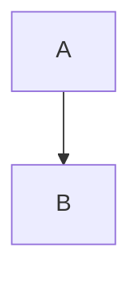

# Story 10.1: Rust Markdown Renderer Module

## Status: Draft

## Story

**As a** user pasting Markdown content,
**I want** the application to render it to properly formatted HTML,
**So that** I can preview documentation with full GFM support in a trusted, offline environment.

## Background

This story implements the core Markdown-to-HTML conversion using the `comrak` Rust library. Comrak provides GitHub Flavored Markdown (GFM) support including tables, strikethrough, task lists, and autolinks - features developers expect from modern Markdown rendering.

The rendered HTML will include semantic class annotations that enable:
1. Syntax highlighting in Code view
2. Mermaid block detection for diagram rendering (Story 10.2)
3. Theme-aware styling in Preview pane (Story 10.5)

## Acceptance Criteria

1. `comrak` dependency added to Cargo.toml with WASM-compatible features
2. `render_markdown(input: &str) -> Result<String, RenderError>` implemented
3. Standard Markdown renders correctly:
   - Headings (h1-h6)
   - Paragraphs
   - Bold, italic, strikethrough
   - Ordered and unordered lists
   - Blockquotes
   - Horizontal rules
   - Links and images
   - Inline code and code blocks
4. GFM extensions render correctly:
   - Tables with alignment
   - Task lists (checkboxes)
   - Strikethrough (~~text~~)
   - Autolinks
5. Fenced code blocks include `language-{lang}` class attribute
6. Mermaid blocks output as `<pre><code class="language-mermaid">...</code></pre>`
7. WASM bindings expose `renderMarkdown` to JavaScript
8. Unit tests cover edge cases (empty input, unicode, deeply nested structures)
9. WASM bundle size increase < 200KB (measured via CI)
10. Render time < 100ms for 500KB Markdown documents

## Tasks / Subtasks

- [ ] Task 1: Add comrak dependency (AC: 1)
  - [ ] Add `comrak = { version = "0.28", default-features = false, features = ["syntect"] }` to Cargo.toml
  - [ ] Verify WASM compilation succeeds
  - [ ] Measure bundle size impact

- [ ] Task 2: Create markdown_renderer.rs module (AC: 2)
  - [ ] Create `src/markdown_renderer.rs`
  - [ ] Add module declaration to `src/lib.rs`
  - [ ] Define `RenderError` type with message field
  - [ ] Implement `render_markdown` function signature

- [ ] Task 3: Configure comrak options (AC: 3, 4, 5, 6)
  - [ ] Enable GFM extensions (tables, strikethrough, tasklists, autolink)
  - [ ] Configure code block rendering with language classes
  - [ ] Enable safe mode (no raw HTML passthrough for security)
  - [ ] Set appropriate render options (hardbreaks, smart punctuation)

- [ ] Task 4: Implement render_markdown (AC: 3, 4)
  - [ ] Parse input with comrak
  - [ ] Handle empty input gracefully
  - [ ] Return HTML string on success
  - [ ] Return RenderError with message on failure

- [ ] Task 5: Add WASM bindings (AC: 7)
  - [ ] Add `#[wasm_bindgen]` annotation
  - [ ] Create JS-friendly wrapper that returns JSON result
  - [ ] Handle string conversion and error serialization

- [ ] Task 6: Write unit tests (AC: 8)
  - [ ] Test: empty string → empty output
  - [ ] Test: `# Heading` → `<h1>Heading</h1>`
  - [ ] Test: `**bold**` → `<strong>bold</strong>`
  - [ ] Test: GFM table renders as `<table>`
  - [ ] Test: `- [ ] task` renders checkbox
  - [ ] Test: ``` code block has language class
  - [ ] Test: ```mermaid block has `language-mermaid` class
  - [ ] Test: Unicode content preserved
  - [ ] Test: Deeply nested lists (10+ levels)
  - [ ] Test: Large document (500KB) completes < 100ms

- [ ] Task 7: Performance validation (AC: 9, 10)
  - [ ] Add benchmark test for 500KB document
  - [ ] Verify bundle size in CI output
  - [ ] Document performance characteristics

## Dev Notes

### Relevant Source Tree

```
src/
├── lib.rs              # Add mod markdown_renderer
├── markdown_renderer.rs # NEW: Markdown rendering module
├── formatter.rs        # Reference: JSON formatter pattern
└── xml_formatter.rs    # Reference: XML formatter pattern

Cargo.toml              # Add comrak dependency
```

### Comrak Configuration

```rust
use comrak::{markdown_to_html, Options, ExtensionOptions, RenderOptions};

pub fn render_markdown(input: &str) -> Result<String, RenderError> {
    if input.is_empty() {
        return Ok(String::new());
    }

    let mut options = Options::default();

    // GFM extensions
    options.extension.strikethrough = true;
    options.extension.table = true;
    options.extension.autolink = true;
    options.extension.tasklist = true;
    options.extension.superscript = true;

    // Render options
    options.render.unsafe_ = false;  // Security: no raw HTML
    options.render.hardbreaks = false;

    let html = markdown_to_html(input, &options);
    Ok(html)
}
```

### WASM Binding Pattern

```rust
#[wasm_bindgen]
pub fn renderMarkdown(input: &str) -> String {
    match render_markdown(input) {
        Ok(html) => html,
        Err(e) => format!("<div class=\"error\">{}</div>", e.message),
    }
}
```

### Code Block Output Format

Input:
````markdown
```javascript
const x = 1;
```
````

Output:
```html
<pre><code class="language-javascript">const x = 1;
</code></pre>
```

### Mermaid Block Detection

The Mermaid blocks will be output as standard code blocks with the `language-mermaid` class. Story 10.2 (Mermaid.js integration) will detect these blocks and render them to SVG.

Input:
````markdown

````

Output:
```html
<pre><code class="language-mermaid">graph TD
    A --> B
</code></pre>
```

## Testing

### Test Location
- Rust unit tests: `src/markdown_renderer.rs` (inline `#[cfg(test)]` module)
- WASM integration: `tests/markdown_wasm_test.js` (if needed)

### Test Cases

| Input | Expected Output | Notes |
|-------|-----------------|-------|
| `` | `` | Empty input |
| `# Hello` | `<h1>Hello</h1>` | Heading |
| `**bold**` | `<strong>bold</strong>` | Bold |
| `*italic*` | `<em>italic</em>` | Italic |
| `~~strike~~` | `<del>strike</del>` | GFM strikethrough |
| `- [ ] task` | `<input type="checkbox" ...>` | GFM task list |
| `\| a \| b \|` | `<table>...</table>` | GFM table |
| ``` ```js\ncode\n``` ``` | `<code class="language-js">` | Code block |
| `[link](url)` | `<a href="url">link</a>` | Link |
| Unicode: `日本語` | `日本語` preserved | Unicode support |

### Running Tests

```bash
# Run Rust unit tests
cargo test markdown

# Build WASM and verify size
wasm-pack build --target web
ls -la pkg/*.wasm
```

## Definition of Done

- [ ] All acceptance criteria met
- [ ] All tasks completed
- [ ] Unit tests passing
- [ ] WASM builds successfully
- [ ] Bundle size increase verified < 200KB
- [ ] Performance benchmark passing (< 100ms for 500KB)
- [ ] Code reviewed

## Dependencies

- **Depends on:** None (can start immediately)
- **Blocks:** 10.3 (Bridge Layer), 10.6 (Syntax Highlighting)

## Estimate

3 points

## Change Log

| Date | Version | Description | Author |
|------|---------|-------------|--------|
| 2026-01-28 | 1.0 | Story created from Epic 10.0 | Sarah (PO) |
