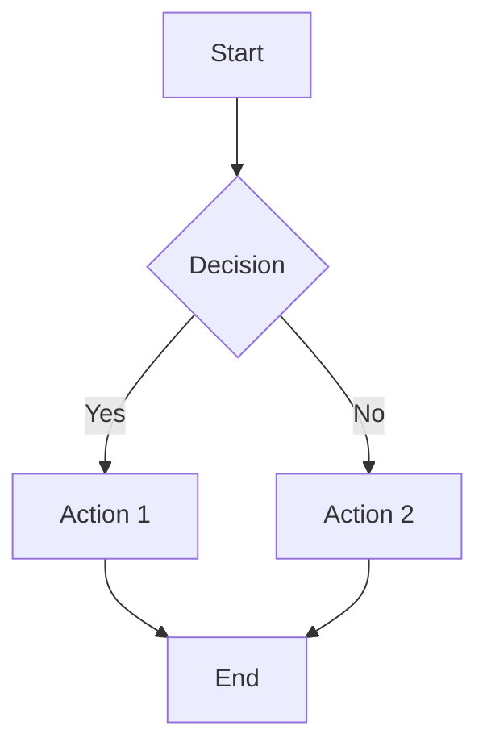
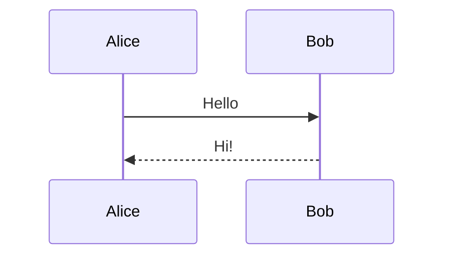
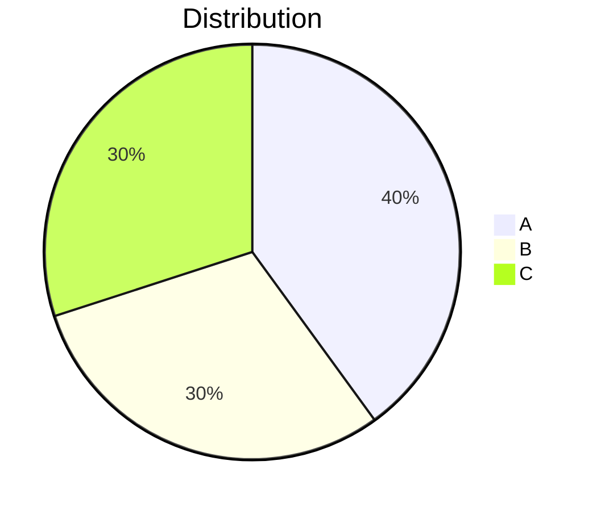

# Story 10.2: Mermaid.js Library Integration

## Status: Draft

## Story

**As a** user with Markdown containing Mermaid diagram blocks,
**I want** the diagrams rendered as SVG graphics,
**So that** I can visualize flowcharts, sequences, and other diagrams in my documentation.

## Background

Mermaid.js is the industry-standard library for rendering text-based diagrams. This story adds mermaid.js as a bundled JavaScript library (no CDN) and creates a wrapper function for secure, theme-aware diagram rendering.

The library is ~2MB but provides comprehensive diagram support that justifies the size for a documentation-focused tool. It will be loaded alongside the application (not lazy-loaded initially) to maintain the airgap guarantee.

## Acceptance Criteria

1. Mermaid.js library added to `/public/` assets (bundled, not CDN)
2. Mermaid configured with secure defaults:
   - `securityLevel: 'strict'`
   - No external resource loading
   - XSS-safe SVG output
3. `renderMermaid(code, theme)` wrapper function implemented
4. Supported diagram types render correctly:
   - Flowchart (`graph TD`, `flowchart LR`)
   - Sequence diagram
   - Class diagram
   - State diagram
   - ER diagram
   - Gantt chart
   - Pie chart
   - Mindmap
5. Invalid diagram syntax returns error message (not crash)
6. Diagrams respect dark/light theme (Theme.qml colors)
7. Service Worker cache manifest updated to include mermaid.js
8. No network requests made by mermaid.js (verified in DevTools)
9. Render time < 500ms per diagram for typical complexity

## Tasks / Subtasks

- [ ] Task 1: Add mermaid.js to project (AC: 1)
  - [ ] Download mermaid.min.js (latest stable, ~2MB)
  - [ ] Place in `/public/lib/mermaid.min.js`
  - [ ] Add script tag to `index.html` (defer loading)
  - [ ] Verify file loads without network errors

- [ ] Task 2: Configure mermaid security (AC: 2, 8)
  - [ ] Create `/public/mermaid-config.js` initialization script
  - [ ] Set `securityLevel: 'strict'`
  - [ ] Disable `startOnLoad` (manual rendering only)
  - [ ] Configure `fontFamily` to match Theme.qml monoFont
  - [ ] Verify no external requests in Network tab

- [ ] Task 3: Implement renderMermaid wrapper (AC: 3)
  - [ ] Create `renderMermaid(code, elementId)` function in bridge.js
  - [ ] Handle async rendering with Promise
  - [ ] Return SVG string on success
  - [ ] Return error object on failure

- [ ] Task 4: Implement theme integration (AC: 6)
  - [ ] Create `getMermaidTheme(isDark)` function
  - [ ] Map Theme.qml colors to mermaid theme variables
  - [ ] Dark theme: `theme: 'dark'` with custom colors
  - [ ] Light theme: `theme: 'default'` with custom colors
  - [ ] Re-render diagrams on theme change

- [ ] Task 5: Error handling (AC: 5)
  - [ ] Wrap mermaid.render in try/catch
  - [ ] Parse mermaid error messages
  - [ ] Return structured error with line info if available
  - [ ] Generate error SVG/HTML for display

- [ ] Task 6: Test all diagram types (AC: 4)
  - [ ] Test flowchart (graph TD, flowchart LR)
  - [ ] Test sequence diagram
  - [ ] Test class diagram
  - [ ] Test state diagram
  - [ ] Test ER diagram
  - [ ] Test gantt chart
  - [ ] Test pie chart
  - [ ] Test mindmap

- [ ] Task 7: Update Service Worker (AC: 7)
  - [ ] Add `/lib/mermaid.min.js` to cache manifest
  - [ ] Add `/mermaid-config.js` to cache manifest
  - [ ] Increment cache version
  - [ ] Test offline loading

- [ ] Task 8: Performance validation (AC: 9)
  - [ ] Measure render time for each diagram type
  - [ ] Test complex diagrams (20+ nodes)
  - [ ] Document performance characteristics

## Dev Notes

### Relevant Source Tree

```
public/
├── index.html          # Add mermaid script tag
├── bridge.js           # Add renderMermaid function
├── mermaid-config.js   # NEW: Mermaid initialization
├── lib/
│   └── mermaid.min.js  # NEW: Mermaid library (~2MB)
└── sw.js               # Update cache manifest
```

### Mermaid Configuration

```javascript
// public/mermaid-config.js
document.addEventListener('DOMContentLoaded', () => {
    if (typeof mermaid !== 'undefined') {
        mermaid.initialize({
            startOnLoad: false,           // Manual rendering only
            securityLevel: 'strict',      // XSS protection
            theme: 'dark',                // Default theme
            fontFamily: 'Consolas, Monaco, "Courier New", monospace',
            logLevel: 'error',            // Suppress verbose logging

            // Disable features that might make network requests
            flowchart: {
                useMaxWidth: true,
                htmlLabels: false         // Safer rendering
            }
        });
        console.log('[Mermaid] Initialized with secure defaults');
    }
});
```

### renderMermaid Implementation

```javascript
// In bridge.js
let mermaidIdCounter = 0;

async function renderMermaid(code, theme = 'dark') {
    if (typeof mermaid === 'undefined') {
        return { success: false, error: 'Mermaid library not loaded' };
    }

    const id = `mermaid-${++mermaidIdCounter}`;

    try {
        // Update theme before rendering
        mermaid.initialize({ theme: theme === 'dark' ? 'dark' : 'default' });

        const { svg } = await mermaid.render(id, code);
        return { success: true, svg: svg };
    } catch (e) {
        return {
            success: false,
            error: e.message || 'Failed to render diagram',
            details: e.toString()
        };
    }
}

// Export to window for Qt access
window.renderMermaid = renderMermaid;
```

### Theme Color Mapping

```javascript
function getMermaidThemeConfig(isDark) {
    if (isDark) {
        return {
            theme: 'dark',
            themeVariables: {
                primaryColor: '#0078d4',
                primaryTextColor: '#d4d4d4',
                primaryBorderColor: '#3c3c3c',
                lineColor: '#808080',
                secondaryColor: '#252526',
                tertiaryColor: '#2d2d2d',
                background: '#1e1e1e',
                mainBkg: '#252526',
                nodeBorder: '#3c3c3c',
                clusterBkg: '#2d2d2d',
                titleColor: '#d4d4d4',
                edgeLabelBackground: '#252526'
            }
        };
    } else {
        return {
            theme: 'default',
            themeVariables: {
                primaryColor: '#0066cc',
                primaryTextColor: '#1e1e1e',
                // ... light theme colors
            }
        };
    }
}
```

### Error Display Format

When mermaid fails to parse a diagram, display a styled error:

```html
<div class="mermaid-error">
    <strong>Mermaid Syntax Error</strong>
    <pre>Parse error on line 3:
...A --> B --> C
---------^
Expecting 'SEMI', got 'ARROW'</pre>
</div>
```

### Sample Diagrams for Testing







## Testing

### Test Location
- Manual testing in browser
- Integration tests via bridge.js calls

### Test Cases

| Diagram Type | Input | Expected | Notes |
|--------------|-------|----------|-------|
| Flowchart | `graph TD; A-->B` | SVG with 2 nodes | Basic flow |
| Sequence | `sequenceDiagram; A->>B: msg` | SVG with actors | Messages |
| Class | `classDiagram; class A` | SVG with class box | UML |
| State | `stateDiagram-v2; [*]-->A` | SVG with states | Transitions |
| ER | `erDiagram; A \|\|--o{ B : has` | SVG with entities | Relationships |
| Gantt | `gantt; task1: a1, 2024-01-01, 7d` | SVG timeline | Dates |
| Pie | `pie; "A": 50; "B": 50` | SVG circle | Percentages |
| Mindmap | `mindmap; root((Main))` | SVG tree | Hierarchy |
| Invalid | `graph TD; A-->` | Error message | Graceful fail |

### Verification Steps

1. Load application with DevTools Network tab open
2. Verify mermaid.js loads from local path (not CDN)
3. Verify no external requests after initial load
4. Render each diagram type
5. Toggle theme and verify diagrams re-render
6. Test invalid syntax error handling

## Definition of Done

- [ ] All acceptance criteria met
- [ ] All tasks completed
- [ ] All 8 diagram types render correctly
- [ ] Error handling works for invalid syntax
- [ ] Theme integration works (dark/light)
- [ ] No network requests from mermaid.js
- [ ] Service Worker caches mermaid.js
- [ ] Performance acceptable (< 500ms per diagram)

## Dependencies

- **Depends on:** None (can start immediately, parallel with 10.1)
- **Blocks:** 10.3 (Bridge Layer)

## Estimate

2 points

## Change Log

| Date | Version | Description | Author |
|------|---------|-------------|--------|
| 2026-01-28 | 1.0 | Story created from Epic 10.0 | Sarah (PO) |
