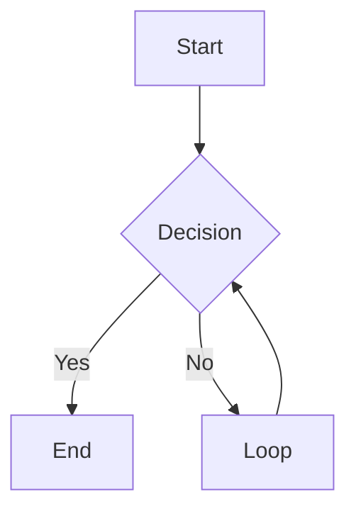
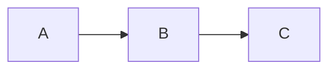
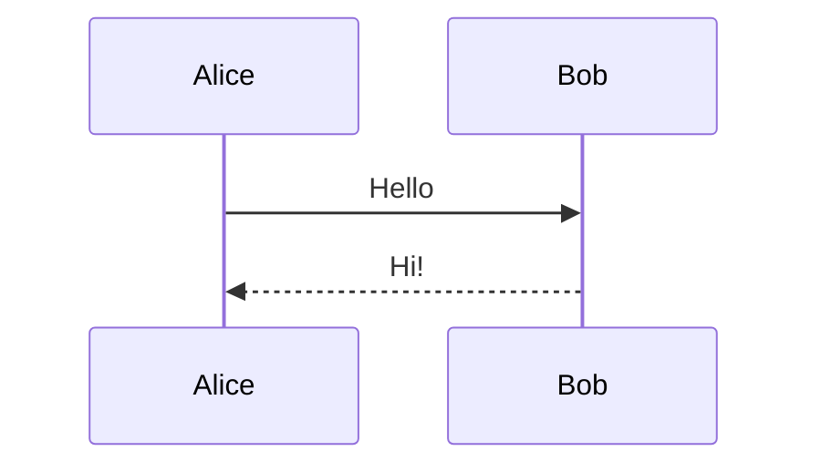
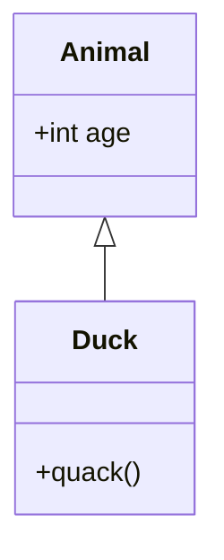
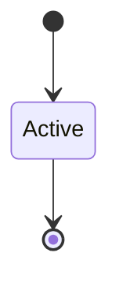
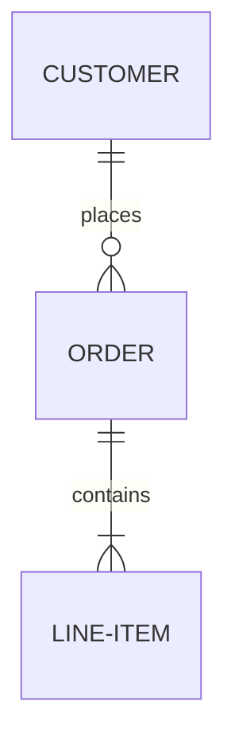
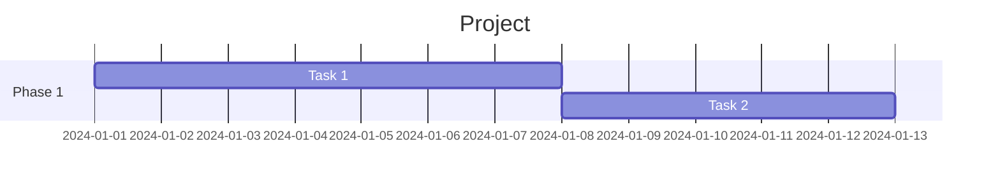
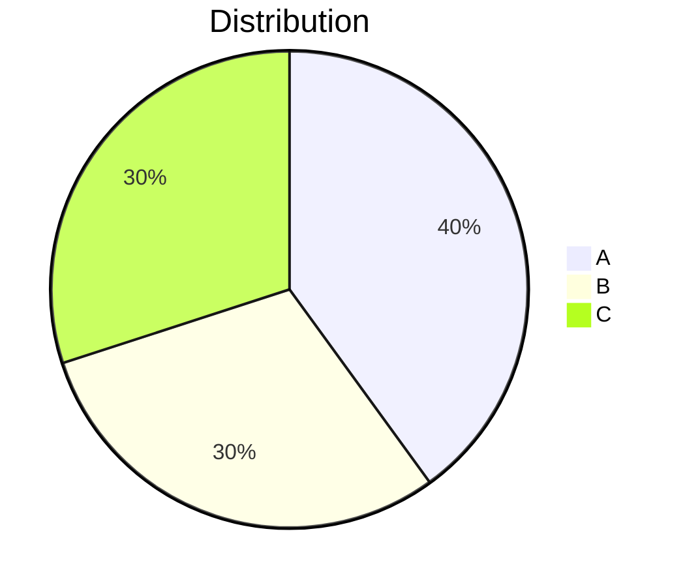
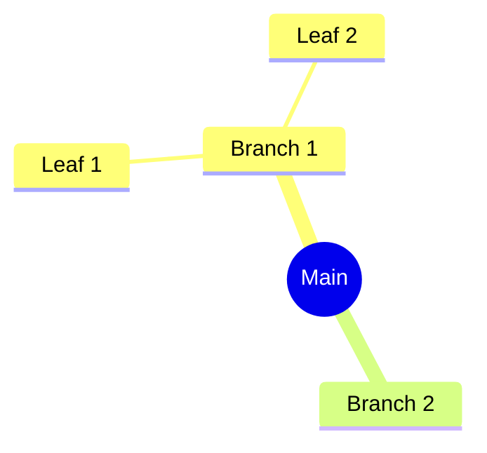

# Story 10.8: Markdown + Mermaid Integration Testing

## Status: Draft

## Story

**As a** product owner,
**I want** comprehensive end-to-end testing of the Markdown + Mermaid feature,
**So that** I can verify all components work together correctly before release.

## Background

This story validates the complete Markdown + Mermaid workflow by testing:
1. Format auto-detection
2. Markdown rendering (all GFM features)
3. Mermaid diagram rendering (all diagram types)
4. Error handling
5. Theme integration
6. Performance
7. Cross-browser compatibility
8. Regression testing (existing JSON/XML functionality)

## Acceptance Criteria

1. All GFM Markdown features render correctly:
   - Headings (h1-h6)
   - Paragraphs and line breaks
   - Bold, italic, strikethrough
   - Ordered and unordered lists
   - Task lists (checkboxes)
   - Tables with alignment
   - Code blocks with syntax class
   - Blockquotes
   - Horizontal rules
   - Links and images
2. All Mermaid diagram types render correctly:
   - Flowchart (graph TD, flowchart LR)
   - Sequence diagram
   - Class diagram
   - State diagram
   - ER diagram
   - Gantt chart
   - Pie chart
   - Mindmap
3. Invalid Mermaid syntax shows helpful error message
4. Format auto-detection correctly identifies Markdown
5. Theme toggle updates both syntax highlighting and preview
6. Performance meets requirements:
   - Markdown render < 100ms for 500KB
   - Mermaid render < 500ms per diagram
   - Total render < 2s for document with 5 diagrams
7. Works in all target browsers:
   - Chrome 90+
   - Firefox 88+
   - Safari 14+
   - Edge 90+
8. No regression in existing JSON/XML functionality
9. Copy functionality works for rendered HTML
10. History save/load works for Markdown documents

## Tasks / Subtasks

- [ ] Task 1: Create test document suite
  - [ ] Create comprehensive Markdown test document
  - [ ] Create Mermaid diagram test cases (all types)
  - [ ] Create edge case documents (large, malformed, unicode)
  - [ ] Create regression test documents (JSON, XML)

- [ ] Task 2: Test GFM features (AC: 1)
  - [ ] Test headings h1-h6
  - [ ] Test paragraphs and soft/hard breaks
  - [ ] Test bold (**), italic (*), strikethrough (~~)
  - [ ] Test unordered lists (-, *)
  - [ ] Test ordered lists (1., 2.)
  - [ ] Test task lists (- [ ], - [x])
  - [ ] Test tables with left/center/right alignment
  - [ ] Test fenced code blocks with language
  - [ ] Test indented code blocks
  - [ ] Test blockquotes (nested)
  - [ ] Test horizontal rules (---, ***, ___)
  - [ ] Test links [text](url)
  - [ ] Test images 
  - [ ] Test autolinks

- [ ] Task 3: Test Mermaid diagrams (AC: 2)
  - [ ] Test flowchart: `graph TD; A-->B`
  - [ ] Test flowchart: `flowchart LR; A-->B`
  - [ ] Test sequence: `sequenceDiagram; A->>B: msg`
  - [ ] Test class: `classDiagram; class A`
  - [ ] Test state: `stateDiagram-v2; [*]-->A`
  - [ ] Test ER: `erDiagram; A ||--o{ B : has`
  - [ ] Test gantt: `gantt; task: a, 2024-01-01, 7d`
  - [ ] Test pie: `pie; "A": 50`
  - [ ] Test mindmap: `mindmap; root((Main))`

- [ ] Task 4: Test error handling (AC: 3)
  - [ ] Test invalid Mermaid syntax
  - [ ] Test partial Mermaid (missing closing ```)
  - [ ] Test empty Mermaid block
  - [ ] Verify error message is displayed
  - [ ] Verify other content still renders

- [ ] Task 5: Test format detection (AC: 4)
  - [ ] Test `# Heading` → markdown
  - [ ] Test code blocks → markdown
  - [ ] Test `---` frontmatter → markdown
  - [ ] Test lists → markdown
  - [ ] Test plain text → unknown
  - [ ] Test JSON → json (not markdown)
  - [ ] Test XML → xml (not markdown)

- [ ] Task 6: Test theme integration (AC: 5)
  - [ ] Test dark mode syntax highlighting
  - [ ] Test light mode syntax highlighting
  - [ ] Test dark mode preview pane
  - [ ] Test light mode preview pane
  - [ ] Test dark mode Mermaid diagrams
  - [ ] Test light mode Mermaid diagrams
  - [ ] Test theme toggle updates all views

- [ ] Task 7: Performance testing (AC: 6)
  - [ ] Measure render time for 100KB document
  - [ ] Measure render time for 500KB document
  - [ ] Measure render time for 1MB document
  - [ ] Measure Mermaid render time (simple diagram)
  - [ ] Measure Mermaid render time (complex diagram)
  - [ ] Test document with 5 Mermaid diagrams
  - [ ] Document results in test report

- [ ] Task 8: Cross-browser testing (AC: 7)
  - [ ] Test in Chrome (latest)
  - [ ] Test in Firefox (latest)
  - [ ] Test in Safari (latest)
  - [ ] Test in Edge (latest)
  - [ ] Document any browser-specific issues

- [ ] Task 9: Regression testing (AC: 8)
  - [ ] Test JSON formatting still works
  - [ ] Test JSON minify still works
  - [ ] Test JSON validation still works
  - [ ] Test JSON tree view still works
  - [ ] Test XML formatting still works
  - [ ] Test XML tree view still works
  - [ ] Test format auto-detection for JSON
  - [ ] Test format auto-detection for XML

- [ ] Task 10: Functional testing (AC: 9, 10)
  - [ ] Test Copy button copies HTML
  - [ ] Test view toggle (Code ↔ Preview)
  - [ ] Test history save for Markdown
  - [ ] Test history load for Markdown
  - [ ] Test history deduplication

- [ ] Task 11: Document results
  - [ ] Create test report with pass/fail status
  - [ ] Document any known issues
  - [ ] Document performance benchmarks
  - [ ] Create screenshots for key scenarios

## Dev Notes

### Test Document Suite

**File: `test-data/markdown-comprehensive.md`**
```markdown
# Heading 1

## Heading 2

### Heading 3

Regular paragraph with **bold**, *italic*, and ~~strikethrough~~.

- Unordered item 1
- Unordered item 2
  - Nested item

1. Ordered item 1
2. Ordered item 2

- [ ] Unchecked task
- [x] Checked task

| Left | Center | Right |
|:-----|:------:|------:|
| A    | B      | C     |

```javascript
const code = "highlighted";
```

> Blockquote
> Multiple lines

---

[Link](https://example.com)



```

**File: `test-data/mermaid-all-types.md`**
```markdown
# Mermaid Diagram Types

## Flowchart


## Sequence


## Class


## State


## ER


## Gantt


## Pie


## Mindmap

```

### Performance Test Script

```javascript
// Browser console test
async function performanceTest() {
    const testSizes = [
        { name: '100KB', content: generateMarkdown(100 * 1024) },
        { name: '500KB', content: generateMarkdown(500 * 1024) },
        { name: '1MB', content: generateMarkdown(1024 * 1024) }
    ];

    for (const test of testSizes) {
        const start = performance.now();
        await JsonBridge.renderMarkdownWithMermaid(test.content, 'dark');
        const elapsed = performance.now() - start;
        console.log(`${test.name}: ${elapsed.toFixed(2)}ms`);
    }
}

function generateMarkdown(targetSize) {
    const block = '# Heading\n\nParagraph with **bold** and *italic*.\n\n- List item\n\n';
    const repeats = Math.ceil(targetSize / block.length);
    return block.repeat(repeats);
}
```

### Cross-Browser Test Checklist

| Feature | Chrome | Firefox | Safari | Edge |
|---------|--------|---------|--------|------|
| Page loads | [ ] | [ ] | [ ] | [ ] |
| WASM initializes | [ ] | [ ] | [ ] | [ ] |
| Mermaid loads | [ ] | [ ] | [ ] | [ ] |
| Format detection | [ ] | [ ] | [ ] | [ ] |
| Markdown render | [ ] | [ ] | [ ] | [ ] |
| Mermaid render | [ ] | [ ] | [ ] | [ ] |
| Theme toggle | [ ] | [ ] | [ ] | [ ] |
| Copy to clipboard | [ ] | [ ] | [ ] | [ ] |
| History save/load | [ ] | [ ] | [ ] | [ ] |
| JSON still works | [ ] | [ ] | [ ] | [ ] |
| XML still works | [ ] | [ ] | [ ] | [ ] |

### Test Report Template

```markdown
# Epic 10 Integration Test Report

**Date:** YYYY-MM-DD
**Tester:** [Name]
**Build:** [Version/Commit]

## Summary

| Category | Pass | Fail | Skip |
|----------|------|------|------|
| GFM Features | X | X | X |
| Mermaid Diagrams | X | X | X |
| Error Handling | X | X | X |
| Format Detection | X | X | X |
| Theme Integration | X | X | X |
| Performance | X | X | X |
| Cross-Browser | X | X | X |
| Regression | X | X | X |
| **Total** | **X** | **X** | **X** |

## Performance Results

| Document Size | Target | Actual | Status |
|---------------|--------|--------|--------|
| 500KB Markdown | < 100ms | Xms | ✅/❌ |
| Mermaid (simple) | < 500ms | Xms | ✅/❌ |
| 5 diagrams total | < 2s | Xs | ✅/❌ |

## Browser Results

| Browser | Version | Status | Notes |
|---------|---------|--------|-------|
| Chrome | X.X | ✅/❌ | |
| Firefox | X.X | ✅/❌ | |
| Safari | X.X | ✅/❌ | |
| Edge | X.X | ✅/❌ | |

## Issues Found

1. [Issue description]
   - Severity: High/Medium/Low
   - Steps to reproduce
   - Workaround (if any)

## Conclusion

[Overall assessment and recommendation]
```

## Testing

This IS the testing story - it defines the test plan for the epic.

### Test Artifacts Location

```
test-data/
├── markdown-comprehensive.md
├── mermaid-all-types.md
├── markdown-edge-cases.md
├── large-document-500kb.md
├── regression-json.json
├── regression-xml.xml
└── test-report-template.md
```

## Definition of Done

- [ ] All acceptance criteria met
- [ ] All test cases executed
- [ ] Test report completed
- [ ] Performance benchmarks documented
- [ ] Cross-browser testing completed
- [ ] No critical or high severity bugs
- [ ] Regression tests pass
- [ ] Test artifacts committed to repo

## Dependencies

- **Depends on:** 10.1-10.7 (all other stories in epic)
- **Blocks:** Epic sign-off

## Estimate

3 points

## Change Log

| Date | Version | Description | Author |
|------|---------|-------------|--------|
| 2026-01-28 | 1.0 | Story created from Epic 10.0 | Sarah (PO) |
