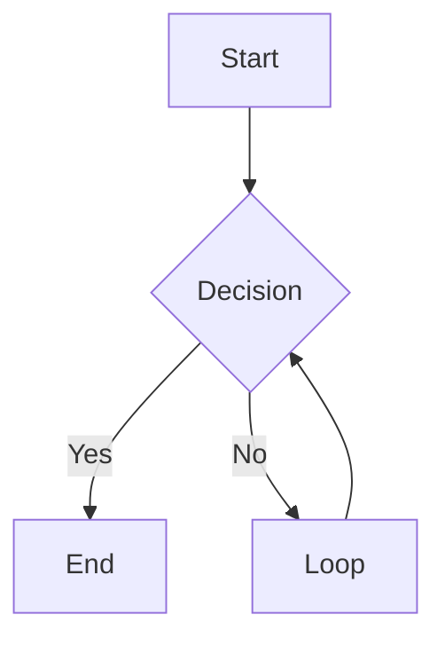

# Heading 1

## Heading 2

### Heading 3

#### Heading 4

##### Heading 5

###### Heading 6

Regular paragraph with **bold**, *italic*, and ~~strikethrough~~.

This is a paragraph with a soft break
that continues on the next line.

This paragraph has a hard break
with two trailing spaces.

- Unordered item 1
- Unordered item 2
  - Nested item 2.1
  - Nested item 2.2
    - Deeply nested item
- Unordered item 3

* Alternative unordered 1
* Alternative unordered 2

1. Ordered item 1
2. Ordered item 2
   1. Nested ordered 2.1
   2. Nested ordered 2.2
3. Ordered item 3

- [ ] Unchecked task
- [x] Checked task
- [ ] Another unchecked task

| Left Aligned | Center Aligned | Right Aligned |
|:-------------|:--------------:|--------------:|
| A            | B              | C             |
| Data 1       | Data 2         | Data 3        |
| Long text    | Medium         | Short         |

```javascript
const code = "highlighted";
function example() {
    return "syntax highlighting test";
}
```

```python
def hello_world():
    print("Python code block")
    return True
```

    This is an indented code block
    It preserves whitespace
    And spans multiple lines

> Blockquote line 1
> Blockquote line 2
>
> > Nested blockquote
> > with multiple lines

---

***

___

[Link to example](https://example.com)

[Link with title](https://example.com "Example Title")


https://autolink-example.com

<https://angle-bracket-autolink.com>

email@example.com



Inline `code` within a paragraph.

Text with **bold and *nested italic* inside**.

Text with *italic and **nested bold** inside*.
