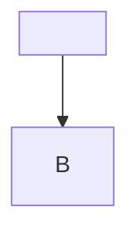
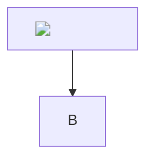
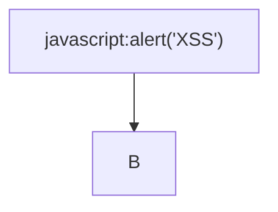
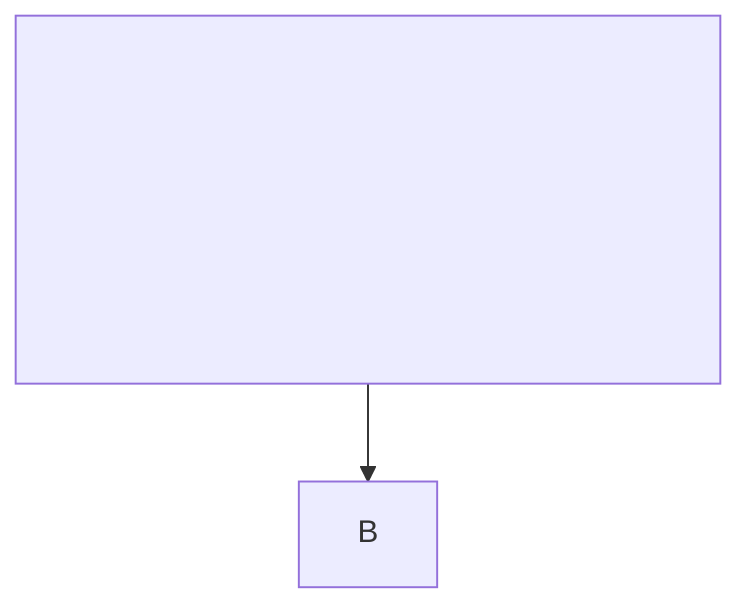

# XSS Security Test Payloads

This document contains XSS attack vectors to verify sanitization.

## Script Tag Injection

<script>alert('XSS')</script>

<script type="text/javascript">alert('XSS')</script>

<SCRIPT>alert('XSS')</SCRIPT>

## Event Handler Injection


<svg onload="alert('XSS')">

<body onload="alert('XSS')">

<div onmouseover="alert('XSS')">Hover me</div>

## JavaScript URI Injection

[Click me](javascript:alert('XSS'))

[Another link](javascript:void(0);alert('XSS'))

<a href="javascript:alert('XSS')">Link</a>

## Data URI Injection

[Data URI](data:text/html,<script>alert('XSS')</script>)

<a href="data:text/html;base64,PHNjcmlwdD5hbGVydCgnWFNTJyk8L3NjcmlwdD4=">Base64</a>

## Image XSS

)

</script>)


## SVG Injection

<svg><script>alert('XSS')</script></svg>

<svg/onload=alert('XSS')>

<svg><foreignObject><script>alert('XSS')</script></foreignObject></svg>

## Style Injection

<style>body{background:url("javascript:alert('XSS')")}</style>

<div style="background:url('javascript:alert(1)')">Styled</div>

<div style="width:expression(alert('XSS'))">Expression</div>

## Encoded Payloads

&#60;script&#62;alert('XSS')&#60;/script&#62;

%3Cscript%3Ealert('XSS')%3C/script%3E

\u003cscript\u003ealert('XSS')\u003c/script\u003e

## Mermaid XSS Attempts









## Link XSS in Markdown

[XSS Link](javascript:alert(String.fromCharCode(88,83,83)))

[XSS Link]( javascript:alert('XSS'))

[XSS Link](	javascript:alert('XSS'))

## Code Block Shouldn't Execute

```html
<script>alert('This should be displayed, not executed')</script>
```

```javascript
alert('This should be displayed, not executed');
```

## Nested XSS Attempts

**<script>alert('XSS')</script>**

**

`<script>alert('XSS')</script>`

> <script>alert('XSS')</script>

- <script>alert('XSS')</script>
- 

| Header |
|--------|
| <script>alert('XSS')</script> |

## HTML5 Vector Attacks

<video><source onerror="alert('XSS')">

<audio src="x" onerror="alert('XSS')">

<input onfocus="alert('XSS')" autofocus>

<marquee onstart="alert('XSS')">

<details open ontoggle="alert('XSS')">

## Meta and Base Tag Injection

<meta http-equiv="refresh" content="0;url=javascript:alert('XSS')">

<base href="javascript:alert('XSS')">

## Form Injection

<form action="javascript:alert('XSS')"><input type="submit"></form>

<button formaction="javascript:alert('XSS')">Click</button>

## Object and Embed

<object data="javascript:alert('XSS')">

<embed src="javascript:alert('XSS')">

## Expected Behavior

All XSS payloads above should be:
1. Escaped or stripped from the output
2. Rendered as plain text where appropriate
3. NOT executed in the browser

If any alert box appears when viewing this document, there is a security vulnerability.
