# Mermaid Diagram Types Test Suite

This document tests all supported Mermaid diagram types.

## 1. Flowchart (graph TD - Top Down)

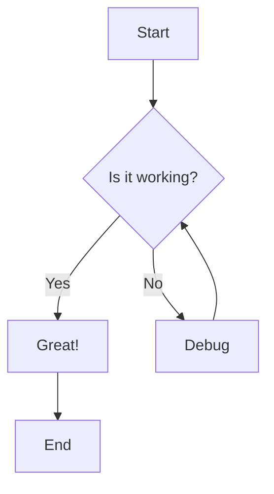

## 2. Flowchart (flowchart LR - Left to Right)

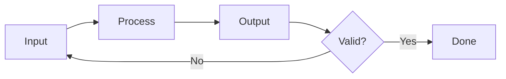

## 3. Sequence Diagram

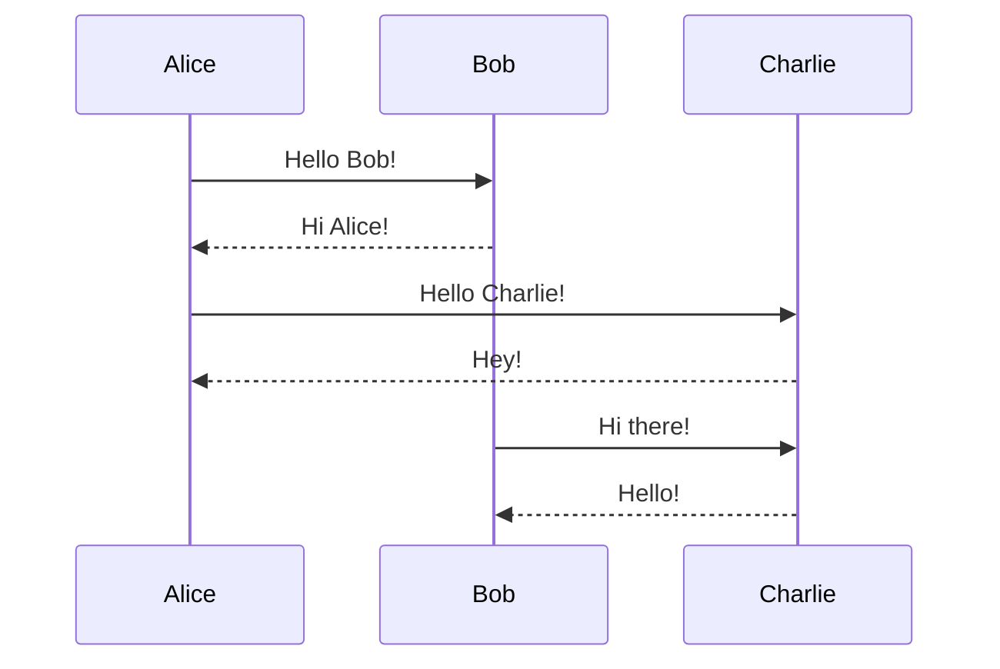

## 4. Class Diagram

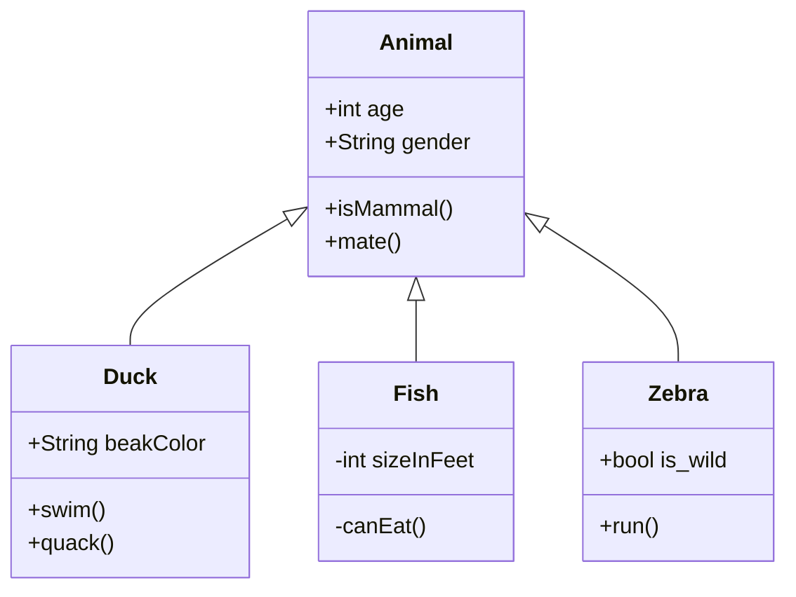

## 5. State Diagram

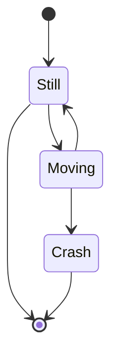

## 6. Entity Relationship Diagram

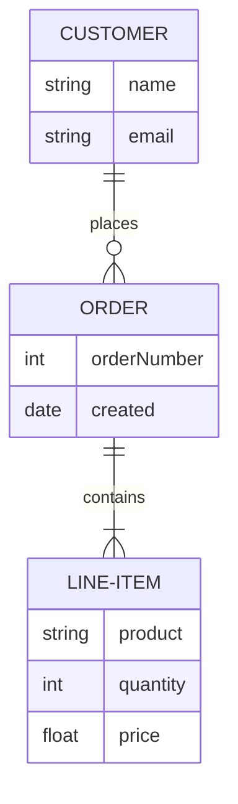

## 7. Gantt Chart

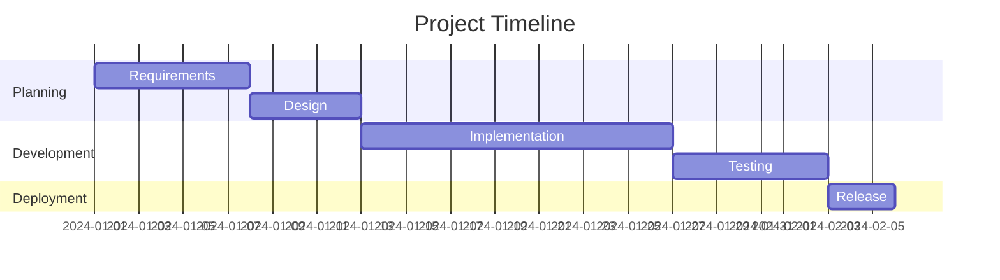

## 8. Pie Chart

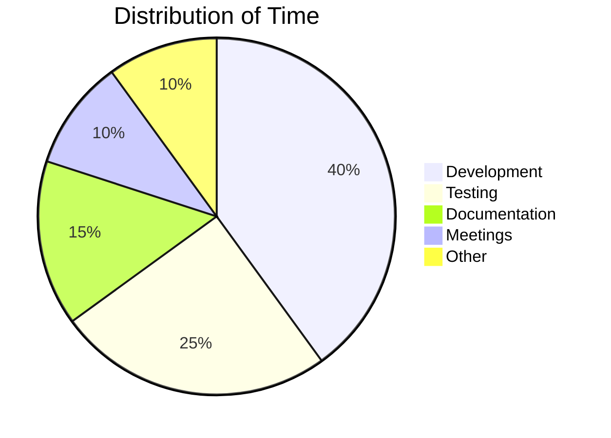

## 9. Mindmap

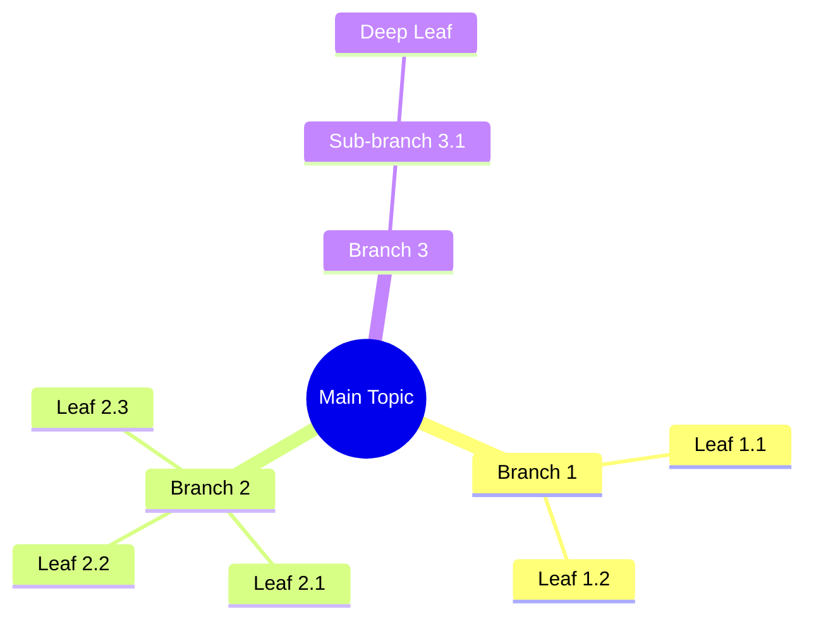

## Multiple Diagrams in One Document

This section tests having multiple diagrams in sequence.

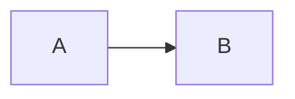

Some text between diagrams.

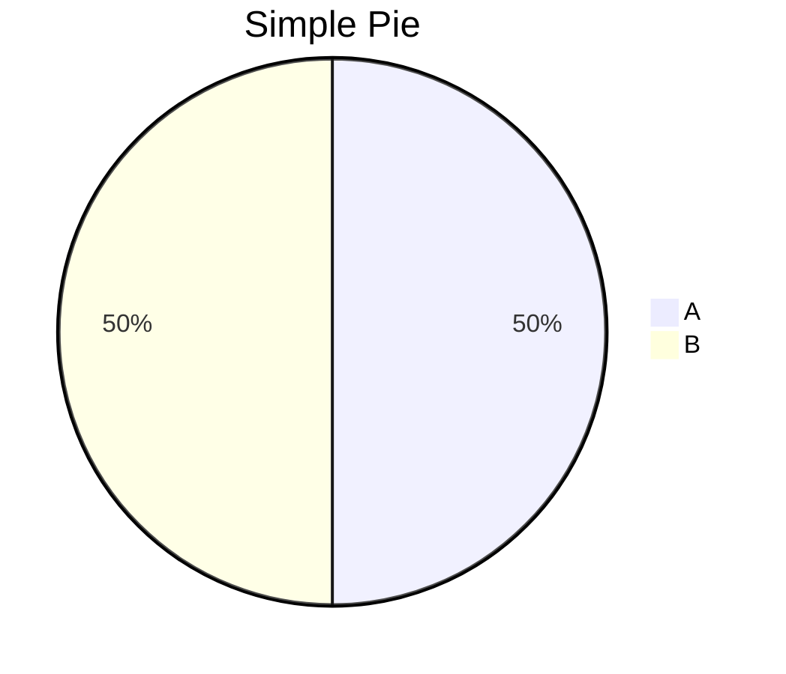
